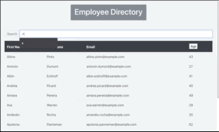

# Employee-Directory-React

## Overview

For this assignment, I have created an employee directory with React. This assignment require me to break up my application's UI into components, manage component state, and respond to user events.

All of the 100 employees come from the Random User API. 
You can search the employees by letters in their first name as well as sort the employees by age (youngest to oldest, oldest to youngest) by selecting the Age button. 

## User Story

* As a user, I want to be able to view my entire employee directory at once so that I have quick access to their information.

## Business Context

An employee or manager would benefit greatly from being able to view non-sensitive data about other employees. It would be particularly helpful to be able to filter employees by name.

## Demo

